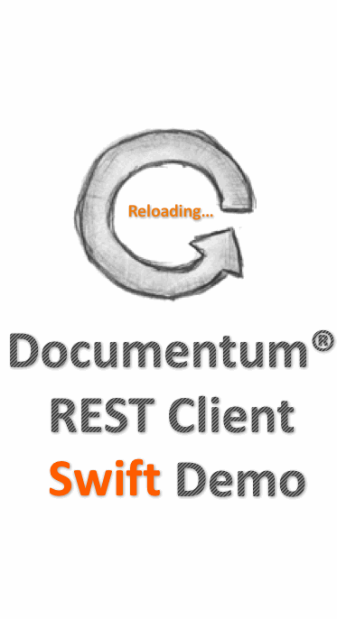

Documentum REST iOS Client Samples in Swift
=========

This iOS project contains a reference implementation of Documentum REST Services client written in Swift code. The
purpose of this project is to demonstrate one way to develop a hypermedia driven REST client to consume Documentum
REST Services. It does NOT indicate that users could not develop a REST client using other technologies.

EMC shares the source code of this project for the technology sharing. If users plan to migrate the sample codes to their
products, they are responsible to maintain this part of the codes in their products and should agree with license polices
of the referenced libraries used by this sample project.


## Overview
This Documentum REST Services client is written with Swift code. This project is organized by [CocoaPods](https://cocoapods.org/).

## System Requirements
1. Documentum REST Services 7.3 is deployed in the development environment.
2. iOS 10.x SDK is installed.
3. [Xcode](https://developer.apple.com/xcode/) is recommended as the IDE to compile, build and run this project.

## Install CocoaPods
Open the terminal in Mac OSX and run below command to install the latest `ruby` (>= 2.2.2).
```sh
$ brew install ruby
```

Run below command to install `CocoaPods`.
```sh
 $ sudo gem install cocoapods
```

## Build and Run
1. Download the project into your local workspace.

2. Double click on the project file `RestClient.xcworkspace` to open the project in `cocoapods` project structure.

3. Open the terminal and navigate to the project directory which contains the file `Podfile`.
```sh
 $ cd documentum-rest-client-swift/SwiftClient
```

4. Run below command to install all dependency libraries for this project.
```sh
 $ pod install
```

5. Copy the bridging file to right place to build bridge between Object-C and Swift.
```sh
 $ cp RestClient-Bridging-Header.h Pods/SWRevealViewController/SWRevealViewController/
```

6. Find the configuration file `database.db` under location `documentum-rest-client-swift/SwiftClient`. It contains the
default connection parameters for Documentum REST Services access. You can change the default values to accommodate to your
Documentum REST Services deployment. Of course, you can also manually fill the connection parameters in the test launcher.

7. Build the project with **Xcode**.
	* Click the Build button or press `⌘R` on **Xcode** IDE to launch the test.

## Demo


